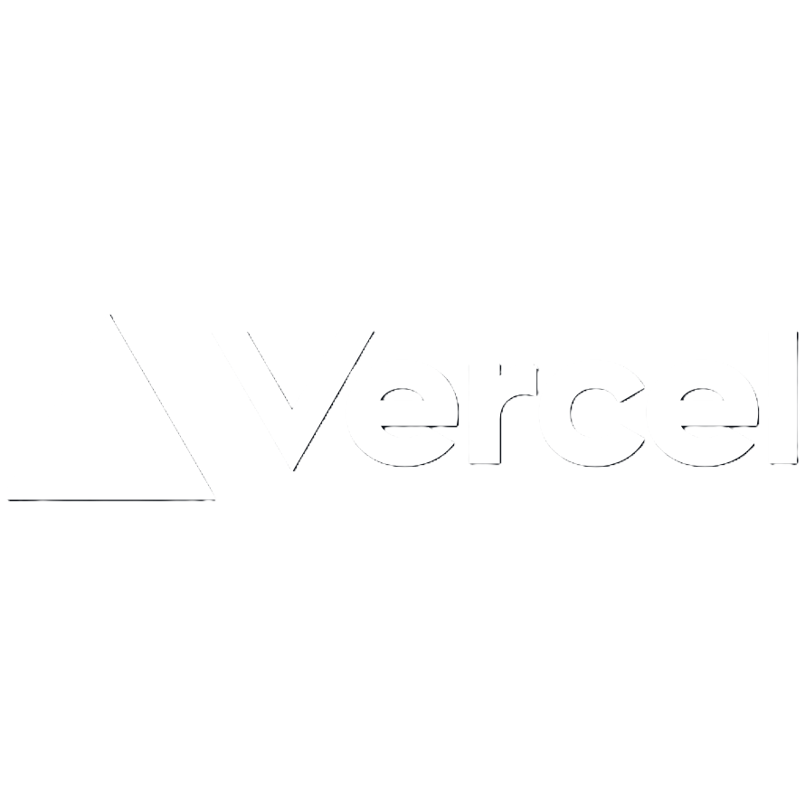

# **Indoor Mapping - *Navit* ( v2.0 )** 

**Navit is an indoor mapping solution made for University or any other big campus. _(currently, in final integration phase)_**

---
# **Languages, Frameworks and Tools**

 

# How to run this project
- **Backend ( Server ) -** `/backend` `npm install` `npm start` ***( starts the server )***
- **Frontend -** Open `frontend/index.html` ***( home page )*** or <a class="link-danger" href="https://navit.vercel.app/"><b>Navit</b></a>

---
# ⭐ Current Ideas and Features for Development

## Version 1.0  ✅
- [x] Started with a problem in mind and the problem unvealed and changes the significant app fundamental approches to solve the problem and new approches were used. 
- [x] Route Management - Add routes using GeoJSON and calculate the shortest path using Dijkstra's algorithm and appropriate data structures.
- [x] Dynamic Floor Polylines - Create an array of floors to show the polylines floor-wise. Each array element will contain coordinates for that specific floor to create the polyline accordingly.                
___~~(Floor numbering: 0 for ground floor, 1 for first floor and 6 for underground).~~___
- [x] Implement basic functionality for routing.
- [x] Data Structture design and Implementation
- [x] Complete UI Design and improvements.
- [x] Complete Map were Designed in GeoJSON and later improvements were made.
- [x] Complete Routes were Designed in GeoJSON and later improvements were made.
- [x] Utilize the Leaflet library to draw routes on the map with polylines, dynamically using coordinates as an array of strings input.
## Version 1.8 ✅
- [x] Fetch Requests - Move all fetch requests to `server.js` for privacy and security.
- [x] Basic API Design and Implementation.
- [x] Automate direction finding and identify idle classrooms and labs by storing timetables in the database _**(Possible API integration with class-sync)**_.
- [x] ___Floor numbering changed for ease: 0 for underground floor, 1 for ground floor and so on.___ 🟢
- [x] Dynamic Centering - setting dynamic center by using cookies to add coordinates to center. Use the last coordinate to determine the center.
- [x] Database Integration - Introduce a database to store custom maps and routes.
- [ ] _~~Authentication and Security - Implement authentication for students to verify users~~_ **_(cancelled)_**
- [ ] _~~Possibly restrict mapping functionalities to within the campus IP or network for safety concerns~~_ **_(cancelled)_**
## Version 2.0 ⌛ *( under development )*
- [x] Classsync - Integration of Class-sync APIs with Navit.
- [ ] Code Migration - Migration of code into ReactJS completely 
- [ ] React Native - Analyze the benefits and scope of code Migration in React Native. 
## **Keep Coding, Keep Smiling!, Have Fun!** 💻🚀
